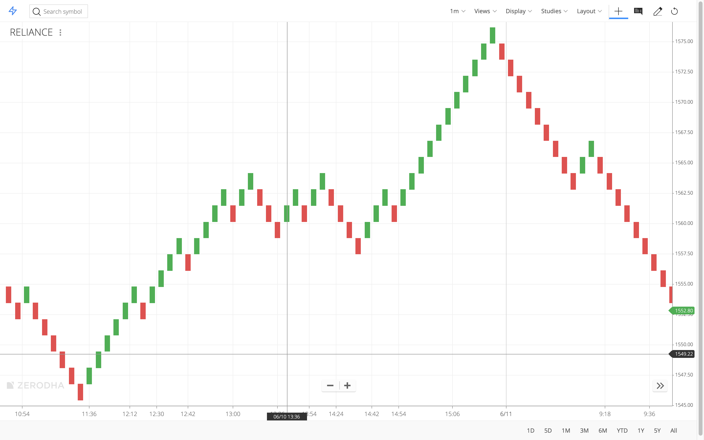

Experiments with Algorithmic trading. The basic idea was to leverage the volatility of the stock market, to make trades with minimal profit, based on the Renko charts.

Data setup - 
1. Download IntradayData_2018 from https://drive.google.com/file/d/1HTSIiA1j9qzqc-CIlOEbj6V1FdyRkH10/view?usp=sharing
2. Unzip and put it into folder called IntradayData_2018

Other Important Links
https://drive.google.com/drive/folders/0B8e3dtbFwQWUZ1I5dklCMmE5M2M
